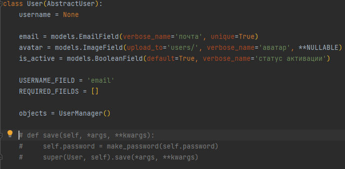
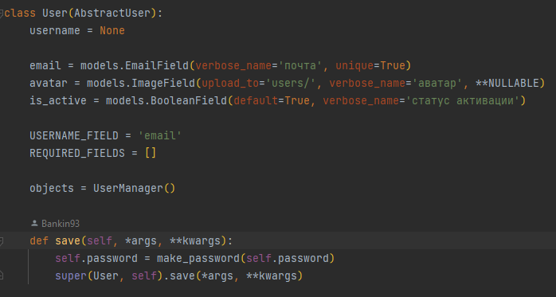
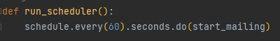

# mailing_project
- **Сервис управления рассылками, администрирования и получения статистики.**

# Запуск на Windows

## **Для начала установите зависимости проекта, указанные в файле `requirements.txt`
```bash
pip install -r requirements.txt
```
## **Далее установите redis глобально себе на компьютер, используйте wsl, терминал Ubuntu
```bash
sudo apt-get update
sudo apt-get install redis
```
После установки запустите сервер Redis с помощью:
```bash
sudo service redis-server start
```
## Создайте файл `.env`
Введите туда свои настройки как указано в файле `.env.sample`
```bash
CACHE_ENABLED=
CACHE_LOCATION=

EMAIL_HOST_USER=
EMAIL_HOST_PASSWORD=

DB_NAME=
DB_USER=
DB_PASSWORD=
DB_HOST=
DB_PORT=
```
## Выполните `migrate`
```bash
python manage.py migrate
```
## Можете загрузить тестовые данные с помощью фикстуры либо создать свои
```bash
python manage.py loaddata db.json
```
## ВАЖНО! Перед тем как создать `superuser`
- **Для начала закомментируйте метод `save` в приложении `users\models.py`.**




- **Затем выполните команду**
```bash
python manage.py createsuperuser
```

- **После разкомментируйте(верните обратно) метод `save` в приложении `users\models.py`.**




Этот метод нужен для того, чтобы можно было создавать пользователей непосредственно в самой административной панели.
Метод при сохранении пользователя хеширует пароль. А при создании суперюзера пароль автоматически хешируется, этот метод
повторно захеширует пароль, что потом не даст вам войти в веб сервис. Поэтому для начала закомментируйте метод, если
планируете создать своего первоначального Суперюзера.

# Для запуска веб сервиса для начала запустите в терминале Ubuntu redis:
```bash
redis-cli
```
## Затем уже в обычном терминале(Windows) запускайте сервис:
```bash
python manage.py runserver
```

# Для запуска рассылок используется библиотека `schedule`. Она позволяет запускать функции по расписанию.
- **Для запуска рассылок используйте команду:**
```bash
 python manage.py services
```
- **Можете поменять расписание удобное для вас. Функция `run_scheduler` находится в приложении `mailing_app\services.py`**




- **Ссылка на документацию: (https://schedule.readthedocs.io/en/stable/)**

